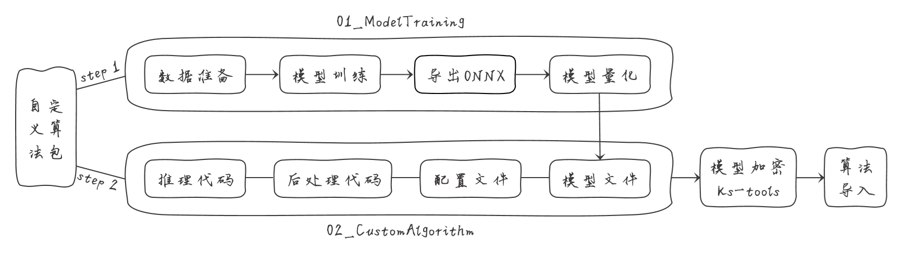

# Custom Algorithm

## 简介

本仓库为开发者和工程师提供一套完整的自定义算法包开发与部署的解决方案。通过本教程，您可以深入了解从数据准备、模型训练、到模型转换与量化，再到自定义算法包的制作与部署的每一个步骤。特别适用于需要在智驱力晓知精灵设备上部署自定义算法的用户。  
- 支持晓知精灵KS968、KS988产品。    

## 自定义算法包流程图

自定义算法包包含两个过程：

- 模型训练过程：参考 **01_ModelTraining** 完成数据准备、模型训练、优化、导出 ONNX 格式、模型量化等步骤。
- 算法定义过程：参考 **02_CustomAlgorithm** 完成推理代码、后处理代码、配置文件编写，完成算法包构建。

## 📂目录结构

### docs
该目录包含了常见问题解答，帮助用户快速理解如何使用该仓库中的功能，解答在使用过程中可能遇到的问题。

### 01_ModelTraining  

该部分提供了多种常见计算机视觉任务的完整训练流程，包括目标检测、图像分类、图像分割、光学字符识别（OCR）和姿态估计等。每个任务都涵盖了数据准备、模型训练、转换与量化等环节，帮助用户高效地进行模型的训练与转换。

### 02_CustomAlgorithm

该部分提供了如何创建和管理自定义算法包的完整教程，内容包括：  
- 01_PackageStructure: 算法包详解
    - 结构样例：展示如何组织算法包的文件结构，便于理解和定制。
    - 参数详解：详细说明算法包中的配置参数，便于自定义调整。
- 02_Demo: 晓知精灵标配算法包参考样例
- 03_Examples: 多种算法逻辑实现样例
    - 提供不同功能算法的代码示例，帮助用户根据具体需求进行算法定制。

### Tools
该目录提供了自定义算法过程中用到的工具和部分依赖文件。

## 🚀 如何使用

本仓库提供了自定义算法包的完整开发流程，以下是使用步骤的详细引导。  

**开发套件工作示意图**

只需开发自定义算法包的四项内容，满足工厂、工地、油田、矿山等场景安全生产监测应用。

### 1. 模型训练量化
- **目标**：在本步骤中，您将训练一个适合您需求的模型。根据具体任务（如目标检测、分类、分割等），选择合适的模型进行训练。  
- **参考内容**：
    - 进入 01_ModelTraining 目录，选择适合您任务的子模块（例如，目标检测使用 YOLOv5 或 YOLOv8，分类任务使用Resnet等）。
    - 按照每个子模块中的教程，完成 环境搭建、数据准备、模型训练和模型转换。如 Yolov5 子模块，参考以下内容：
        - Python 环境安装
        - 数据集准备与预处理
        - 模型训练：确保模型训练完成并达到预期性能，模型文件通常存储在指定的路径中。
        - 模型转换：包括导出ONNX模型、量化操作。

### 2. 自定义算法包
- **目标**：将已训练和量化的模型打包成自定义算法包，方便部署到目标硬件平台，并保护算法包安全。
- **参考内容**：
    - 进入 02_CustomAlgorithm 目录，参考其中的教程和代码示例，创建您的自定义算法包。
    - 按照以下步骤制作算法包：
        - 组织文件结构：参考算法包结构样例，确保您的代码、模型文件和配置文件组织得当。
        - 推理部分：根据使用的模型类型，选择对应的推理代码。
        - 后处理部分：根据任务种类，参考**开发样例**，实现算法功能。
        - 算法包加密：使用 Tools 目录中的加密工具，对算法包进行加密，保障模型和代码的安全性。
    - 算法包完成后，可以将其部署到目标平台。

### 3. 部署与测试
- **目标**：将算法包部署到目标设备，并进行功能测试，确保算法包制作正确。
- **参考内容**：
    - 调试与日志：在 02_CustomAlgorithm/DebugAndLogs 目录下，查阅调试方法和日志查看指南，帮助您快速定位部署中的问题。
  
  
# 联系方式
- 官网：https://www.aidrive-tech.com
- 邮箱：support@aidrive-tech.com

# License
[Apache License 2.0](LICENSE)
